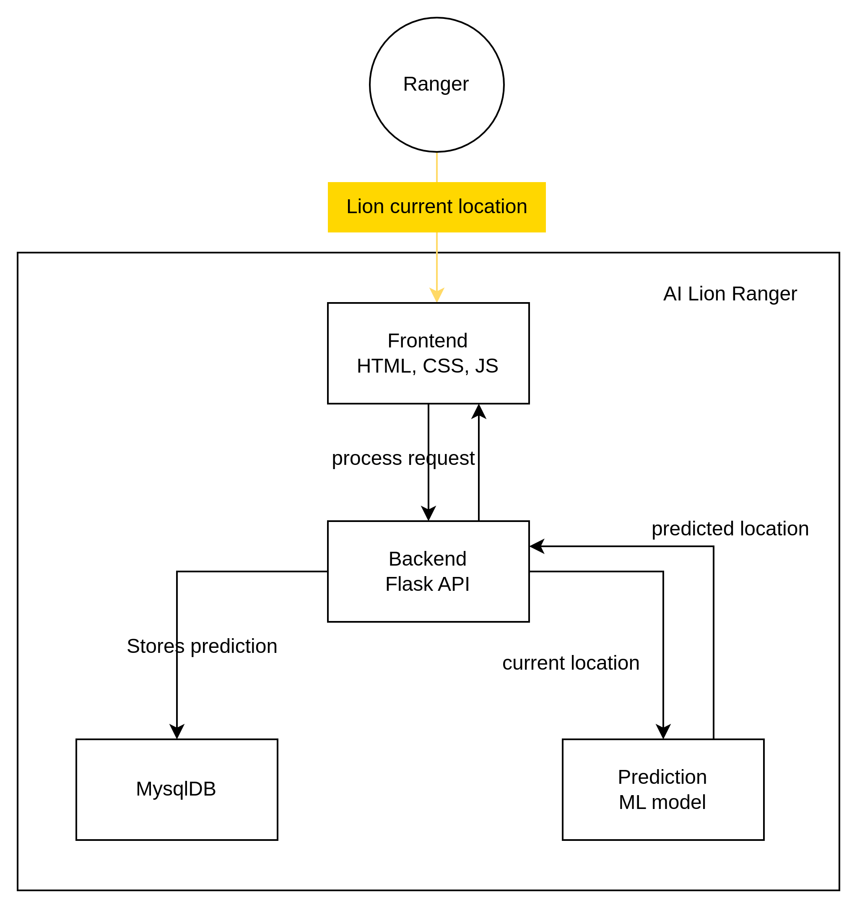
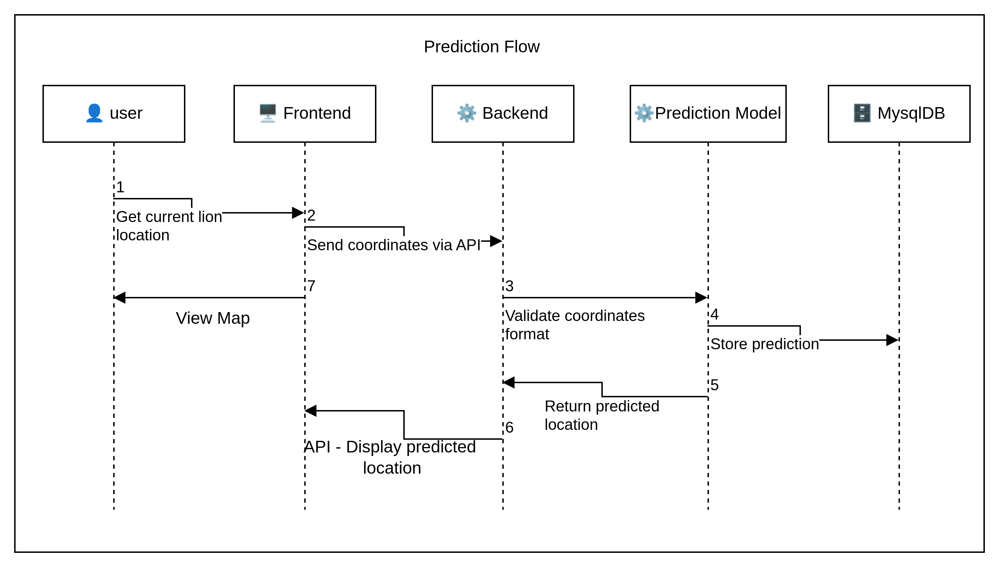
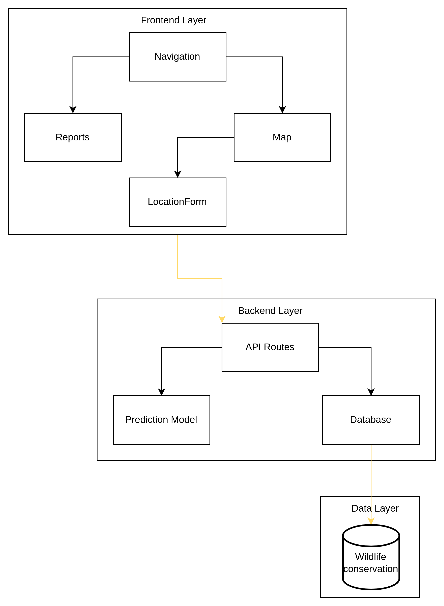
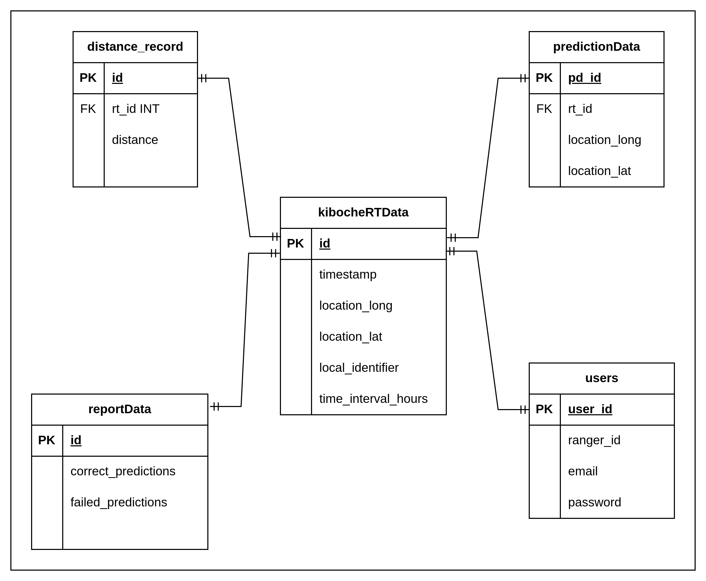

# AI WILDLIFE RANGER

A web based prototype built with Flask that enables rangers to see the future location of a lion and get email alerts when this location is in a restricted area.

## Table of Content

- [AI WILDLIFE RANGER](#ai-wildlife-ranger)
  - [Table of Content](#table-of-content)
  - [Overview](#overview)
  - [Features](#features)
  - [System Architecture](#system-architecture)
    - [Prediction flow](#prediction-flow)
    - [Component Architecture](#component-architecture)
  - [Getting Started](#getting-started)
    - [Prerequisites](#prerequisites)
  - [Installation](#installation)
    - [Clone the repository](#clone-the-repository)
    - [Create virtual environment](#create-virtual-environment)
    - [Install dependencies](#install-dependencies)
    - [Environment Setup](#environment-setup)
    - [Setup Database](#setup-database)
  - [API Documentation](#api-documentation)
  - [Run the App](#run-the-app)
  - [Database Schema](#database-schema)
  - [Useful links](#useful-links)
  - [Troubleshooting tips](#troubleshooting-tips)
    - [Send Email alert to park authority if predicted location is outside the park(Kwale county)](#send-email-alert-to-park-authority-if-predicted-location-is-outside-the-parkkwale-county)
  - [Basic workflow](#basic-workflow)
  - [Directory structure](#directory-structure)
  - [Help](#help)

## Overview

AI Lion Ranger is a prototype designed to reduce human wildlife conflicts by increasing the response time of rangers. Given the current location of a lion, it predicts where it will be in the next two hours.



## Features

- 📍 Predict Locations
- 📍 View Location on Map
- 💬 Feedback
- 📑 Model Performance Report
- 📨 Email Alerts
- 👩‍💻 Authentication

## System Architecture

### Prediction flow



### Component Architecture



## Getting Started

### Prerequisites

- Python3
- Mysql
- vscode
- Internet connection

## Installation

### Clone the repository

```bash
git clone https://github.com/Samboja651/KSU_Final_Year_Project.git
cd KSU_Final_Year_Project
```

### Create virtual environment

On windows run

```bash
C:> py -m pip install --upgrade pip
python3 -m venv .venv
.venv\Scripts\activate
```

On Linux run

```bash
python3 -m pip install --upgrade pip
python3 -m venv .venv
.venv\bin\activate
```

### Install dependencies

```bash
pip install requirements.txt
```

### Environment Setup

Create a `.env` file with following variables

```env
# mysql logins for new user as shown in schema.sql
USER = "wdf_conservatist"
PASSWORD = "@WildlifeTech2025"
HOST = "localhost"
DATABASE = "WDF_conservation"

# scroll to useful links below to download data
GPS_COLLAR_DATA = "Kiboche_last_500_rows_data.csv"

# google maps javasript api key
API_KEY = "YOUR_MAPS_JAVASCRIPT_API_KEY"

# api from opencage to convert coordinates to location name
OPENCAGE_API_KEY = "YOUR_OPENCAGE_API_KEY"

# emailing
SENDER_EMAIL = "YOUR_GMAIL"
SENDER_PASS = "YOUR_GMAIL_APP_PASSWORD"
RECIP_MAIL = "RECEIVER_EMAIL"

# session secret key
SESSION_SECRET_KEY = "YOUR_SELF_GENERATED_KEY"

# sinch sms service - search sinch on internet & follow guides
ACCESS_KEY_ID = "YOUR_SINCH_ACCESS_KEY"
KEY_SECRET = "YOUR_SINCH_KEY_SECRET"
PROJECT_ID = "YOUR_SINCH_PROJECT_ID"
SINCH_NUMBER = "YOUR_SINCH_NUMBER"
RECEIVER_NUMBER = "NUMBER_USED_TO_CREATE_SINCH_ACC"
```

### Setup Database

Paste the content of the `schema.sql` into your mysql and execute.\
Add the portion of the real_time data to the database by the running command below.\
Run the `main.py` file or `python3 main.py` to seed the database.

## API Documentation

```python
# get homepage
GET /

# get model report
GET /model-report

# display map on home page
GET /view-map

# get current lion location
GET /real-time-location/<int:coordinate_id>

# get the predicted location of the lion
# default time_interval = 2
GET /predict/location/<int:coordinate_id>/time/<int:time_interval>

# send email alert
POST /send-email-notification

# create account
GET/POST /register

# login
GET/POST /login

GET /logout
GET/POST /feedback


# replace the part inside <...> with a value e.g /predict/location/1/time/2"
```

## Run the App

On the terminal run `flask run --debug`.

## Database Schema



## Useful links

[Download Lion Kiboche real-time data](https://drive.google.com/uc?id=1N9gEm56eMsf8qcRi3JwQzn2n4cxiuDsA&export=download)\
[Code to ML prediction model](https://colab.research.google.com/drive/1eLzl6sPXAiUuNLhWkPMxFJgJbLa70__4?usp=sharing)

## Troubleshooting tips

Ensure you have installed all dependencies in `requirements.txt` file. Do this in a virtual environment.

Try loading the app on a different browser.

Ensure all env variables are correctly assigned.

### Send Email alert to park authority if predicted location is outside the park(Kwale county)

- first run `pip install Flask-Mail` to install flask_mail lib.
- when the predicted loc coordinate is outside the park, an email sent to park authority informing then so as to take a proactive measure in mitigating HWC.

## Basic workflow

When you pass the current coordinates of a Lion, a prediction is made. If the predicted location crosses Taita Taveta border into Kwale county. An alert by email is sent.

## Directory structure

## Help

We used **Google Maps Javascript API** , **sinch sms service** and an **API from Opencage**. If you find urgent need to test the application with our development **API keys** or values on env file, send an email to <waribekihiko651@gmail.com>.

---
Developed by:\
[Granton Waribe](https://ke.linkedin.com/in/grantonwaribe) as **Full Stack Engineer**.\
[Ezekiah Nyagwaya](https://github.com/Ezekiah3854) as **Full Stack Engineer**.
